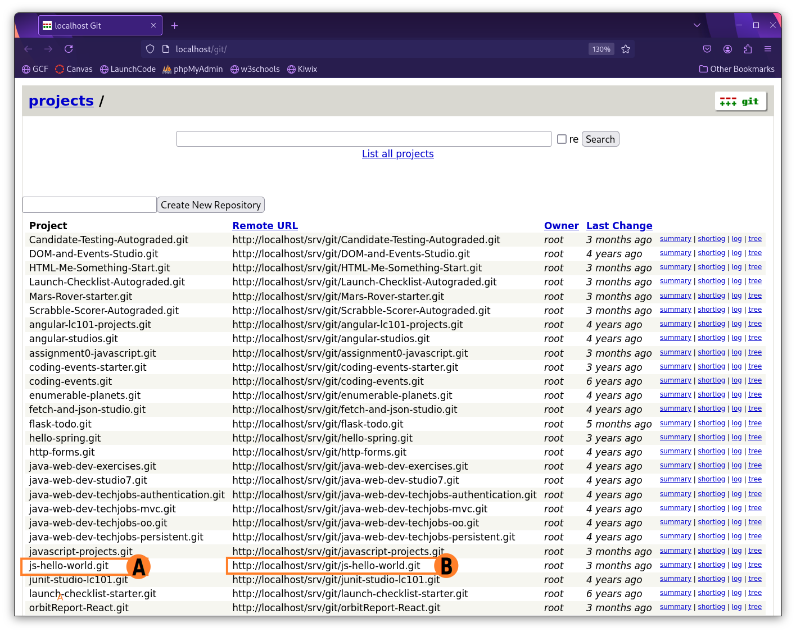
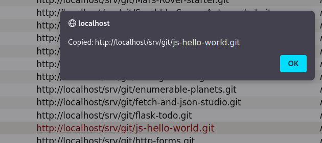
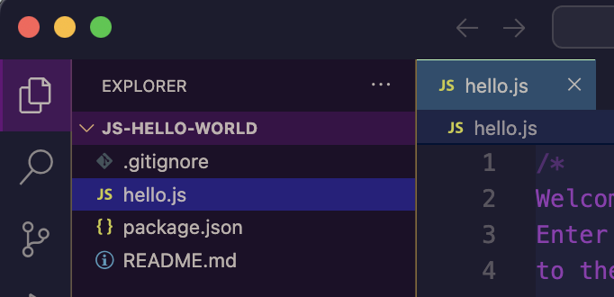

There are sections in this curriculum that require you to have access to the internet which you don't have as an offline student. We didn't want to remove these sections because they illustrate how developers set up their programming environments with the internet. This page seeks to explain how the online curriculum was converted to run offline.

## Chapter 2 Reading: Your First Program
### Your First Program
We are going to walk you through a very simple **workflow**, or sequence of steps, to start coding.

### Read the Instructions

Every starter code repository (repo) in this course will contain instructions.  We strongly suggest you read ALL of the instructions before writing any code.  This will help you understand the goal of your code and may explain any hurdles you might encounter while building your program.

We suggest reading the rest of this page before diving into the code. You will be creating a directory on your computer to store your work, pulling from our GitWeb repository, and practicing with the terminal.  You will do great!

### Starter Code
When you have finished reading through the instructions, use the `js-hello-world` repo to complete your first program.

### Open your terminal

You will use the terminal to create a location to store the code repos.

1. Run the following command: `ls`
This will _list_ any files or directories (folders) wherever you are in the terminal.

   It may look like this:
   ```bash
   ls
   ```

   **Console Output**

   ```console
   Applications   
   Desktop
   Downloads
   Documents
   ...
   ```
1. Choose a folder where you would like to store your course work. This example stores work on the Desktop; you may choose a different location if you desire.

   1. Use the following command to _change directory_, or move, into that folder: `cd <location-name>`
      ```bash
      cd Desktop
      ```
   1. _Make a directory_ (folder) to save your course work: `mkdir <directory-name>`
      ```bash
      mkdir LaunchCode
      ```
   1. To verify if your directory exists run the `ls` command again.  You should see your new directory listed.
   1. Move into your new directory with the following command: `cd <directory-name>`
      ```bash
      cd LaunchCode
      ```

You are now ready to add the repo to your directory.  


### Go to GitWeb

All the git repositories needed for this course are located in GitWeb. You will be provided the name of the repo needed for any particular exercise, studio, or assignment.  You will need to **clone** them to your computer.  When you clone a repo, you are making a copy of the original code.  Any changes you make to the cloned repo will not be applied to the original code.  This keeps the original starter code intact.

1. Open GitWeb by clicking the application icon.
   
      
   
1. Using the GitWeb application locate the desired project and copy its URL to the clipboard.
   
      
   
      A. Find the desired project name in the Project column.
      
      B. Click the corresponding URL in the Remote URL column.
1. You will see the following confirmation that the URL (file path) has been copied to the clipboard.
   
      
   

### Back to the Terminal

Return to your terminal.  You should be in the directory for your course work.

Run the following command: `git clone <paste-the-URL-here>`

   ```bash
   git clone http://localhost/git/REPO-NAME.git
   ```

### Open Visual Studio Code

We haven’t learned how to code yet, but we can still write and run our first program. This exercise asks you to create and run small amounts of code, and it reinforces the LaunchCode principle of learning by doing.

We have used the phrase `Hello, World` as an example throughout this chapter because it represents the traditional first program for a new coder. Printing a single message is one of the simplest tasks a program can carry out.

`Hello, World` will be your first program as well. Welcome to the club!

1. Open your IDE, and open your new repo.  You should see a file tree with the same files from the repo.
   
      
   

1. Double click on `hello.js` to open the file.  You should see instructions and `console.log("Hello");`.  You can type in this file now.  Follow the instructions to complete your first program.  
   1. Enter your code on line 7 to print 'Hello, World!
   1. Open a terminal inside Visual Studio Code.  If you need a refresher, checkout the [installation guide]({}).
   1. Inside your terminal type the following commands
      1. `npm install` [(Offline Student Read Here)]({}). (We will explore this more in future chapters).  You will see that more files and directories have been added to your project. That is expected.
      1. Next type the command `node hello.js`.  This should run the program, which in this case prints your message in the terminal.  
      ```bash
      node hello.js
      Hello World!
      ```
      A. Another way to run your program is to use the _Run and Debug_ button found on the left icon menu of Visual Studio Code.  Set it to `Node.js` for this project.
      
         
      
   1. Try out the other prompts starting at line 10.
   1. When you are done with this code, you will need to `commit` it.  This is how you use git to track each change in your code.
      1. `git status` This will show you all the files you changed in red.
      1. `git add .` This will 'stage', or prepare all the changed files in this directory to be updated in your repo.
      1. `git status` This will show you all your staged files in green, which are now ready to update.
      1. `git commit -m "<type a message here>"` This will 'commit', or finalize your changes in git. Between the quotes, replace the text and carrot symbols `< >` with a short message describing your changes.  This will help you remember what you did while looking through many commits later.

   {} 
   
   Colors may not match exactly as in your terminal.

   ```bash{linenos=table,hl_lines=[],linenostart=1}
   git status
   On branch main
   Your branch is ahead of 'origin/main' by 1 commit.
   (use "git push" to publish your local commits)

   Changes not staged for commit:
   (use "git add <file>..." to update what will be committed)
   (use "git restore <file>..." to discard changes in working directory)
      modified:   hello.js

   Untracked files:
      (use "git add <file>..." to include in what will be committed)
         package-lock.json

   no changes added to commit (use "git add" and/or "git commit -a")

   git add .
   git status
   On branch main
   Your branch is ahead of 'origin/main' by 1 commit.
      (use "git push" to publish your local commits)

   Changes to be committed:
      (use "git restore --staged <file>..." to unstage)
         modified:   hello.js
         new file:   package-lock.json

   git commit -m "now says Hello World"
   [main b1bb194] now says Hello World
   2 files changed, 3457 insertions(+), 1 deletion(-)
    create mode 100644 package-lock.json
   computer:js-hello-world username$$ git push 
   Enumerating objects: 9, done.
   Counting objects: 100% (9/9), done.
   Delta compression using up to 10 threads
   Compressing objects: 100% (7/7), done.
   Writing objects: 100% (7/7), 31.59 KiB | 15.80 MiB/s, done.
   Total 7 (delta 3), reused 0 (delta 0), pack-reused 0
   remote: Resolving deltas: 100% (3/3), completed with 1 local object.
   To https://github.com/USERNAME/js-hello-world.git
      408d555..b1bb194  main -> main
   ```

   1. Line 1 `git status` used to check on the latest version of the project. 
   1. Line 6 notes Changes not staged for commit.  We need to add these.
   1. Line 17 `git add .` will add these to the repo when we are ready to push up.
   1. Line 28 `git commit -m "now says Hello World"` A commit is like taking a photo of the latest version of your code.  The message (`-m`) acts like a caption to keep track of the changes. 

   We will learn more about these in a later chapter.
   {}

   {}
   When writing your commit messages, you will encounter problems if you include punctuation inside of double quotes `"This wont work!"`.

   If you have a strong desire to include punctuation, you must wrap your commit message inside of single quotes `'Like this!'`.
   {}

[(Back to the Reading)]({})

## Chapter 3 Reading: How To Write Code
### JavaScript Projects Repository
The `javascript-projects` git repository is located in GitWeb. For a refresher on locating and cloning git repositories please revisit [this section]({})

[(Back to the Reading)]({})

## npm install

If you are working as an offline student, you do not need to run the `npm install` or `npm i` command (it won't work even if you try). Since you do not have access to the internet, an online developer ran the `npm install` command for you and included the downloaded modules for you to use.

[(Back to the Studio)]({})

<!--
Brandon, Drey, Bill: here is the format for the link to this npm install section

[(Offline Student Read Here)]({})

-->

## Chapter 25 Studio: HTTP and Forms

As an offline student, you may have never used a search engine before. Whether you have or haven't, its important to know that most search engines work the same way. They have a single text input, and they submit data using a `GET` request. Additionally, many of the most popular search engines also use the same name for the search parameter, `q`.

{}
Unfortunately, as an offline student you cannot use a real-world search engine. However, you *can* understand how they work.
Open a new tab in your browser and type this into the URL: `http://handlers.education.launchcode.org/request-parrot?q=your+search+term+here`

Use 2-3 different search terms to get an idea of what is happening.

As you have probably gathered, a `GET` request was made containing the name of the parameter `q` and your search term.
{}

{}
We remarked previously that most forms use `POST` because they cause data to be changed on the server. A web search only *retrieves* data. It does not change data. Therefore it's safe to use a `GET` request for searches.
{} 

The fact that most search engines use the name `q` for their search boxes
will allow us to easily create a form that is capable of sending a search
request to several search engine URLs, even though we can't access the results.
We can, however, observe the URL in the browser and verify that our search engine selector is working properly.

[(Back to the Studio)]({})


## Chapter 29 Reading:
### Create a React Application

Since you are in an offline environment, we took the liberty of using Vite to set up your React applications for you.
To access them, you will need a copy of the LaunchCode React projects repository.

1. Clone the *react-exercises-and-studios repository* from your local server.
1. Switch to the *offline* branch.
1. Navigate into the *react-part-one* root directory:

```console
   $ pwd
      react-exercises-and-studios
   $ ls
      part1 part2 part3
   $ cd part1
   $ cd react-part-one
```

Now that you are in your project's root directory, run the following command:

```bash
npm run dev
```

This will start your local development server and you will see output similar to the below image:


You can view some useful Shortcuts if you press `h`


At this point you can either open a web browser and navigate to `http://localhost:5173` or press `o` if you are within the terminal window running the application.


{}
You do not need to press `h` in order for the shortcuts to work. Once the app is running you can press `o` to view the application within the browser (if you are currently within the terminal window running the application).
{}

[Continue Chapter 29 Reading]({})

## Chapter 29 Exercise: Chores vs. Hobbies

### Complete the `BookList` Component

1. In the `BookList` function, assign a better section heading to the `pageTitle` variable.
   1. The `book` variables should hold URLs for images, but only one is is filled in and it isn't a valid link. 
   Update the three variables to include valid link addresses for three new book releases. Since you're offline,
   we've provided a few book covers for you to choose from. Here's the URL to use: `http://handlers.education.launchcode.org/static/images/books/Title_of_Book.png`

   

   2. In the `return` statement for this component, use JSX in the `img`
      tags to display your chosen images and update the `alt` text to reflect what book you are linking.

      ```jsx
         
      ```

   1. Refresh the webpage to check the updated content.

   {}
   
   This solution includes three books from the latest releases the week we were working on this book. Your code will have different books!

   ```jsx
   <div>
   <h3>{pageTitle}</h3>
   
   
   
   </div>
   ```

   {}

Before moving on, save and commit your work.


[Back to the Exercise]({})


## Chapter 29 Studio: A Few of Your Favorite Recipes

Before you start coding, check out this image of a few popular foods you may enjoy. Go ahead and pick something sweet or savory and jot down the image filename and five of the food's main ingredients. It's time to make a recipe!


### Setting Up Your App

To get started coding, you need to first create an application. Don't worry, we've covered that for you.

1. Open the *react-exercises-and-studios* repository in VSCode.
1. Make sure you are working in the *offline* branch.
1. In your terminal, navigate into the *studio* directory and run `npm run dev`.

Great! You're all set up.

### The Components

First create inside `src`, a folder called `components`. Now tackle creating the components one-by-one.

#### The `RecipeDescription` Component

1. Inside the `components` directory, make a new file called `Description.jsx`.
1. Create a new function called `RecipeAuthor()`. For now, this function may not work as expected, but we have more work to do! Since we can't use our own pictures, here's a few personas for you to choose from.


Once you know the number of the persona you want to be, make sure your function meets the following requirements:

1.  Have no parameters.
   1. Have three local variables: `authorLink`, `authorPhoto`, and `authorName`.
   1. `authorLink` should contain a link. Since we're offline, why not use `http://education.launchcode.org`?
   1. `authorPhoto` should include a URL pointing to a photo of the author. In our case, we'll use `http://handlers.education.launchcode.org/static/images/authors/02.png`. Be sure to plug in the number of the persona you chose above.
   1. `authorName` should contain the author's full name. Use your creative juices and make one up.
   1. Return something similar to the following:

```jsx
return (
  <div className={styles.recipeAuthorBlock}>
    
    <div>
      <h3>{authorName}</h3>
      <a href={authorLink}>Foodie Blog</a>
    </div>
  </div>
);
```

1. Create a new file in the `components` directory called `Description.module.css` and add the following CSS to this file.

    ```css
    .recipeAuthorBlock {
        display: flex;
        justify-content: space-evenly;
    }

    .imageUpdates {
        width: 100px;
        border-radius: 50%;
    }

    .recipePhoto{
         width: 200px;
          border-radius: 20px;
    }
    ```

1. Return to `Description.jsx` and add this `import` statement: `import styles from './Description.module.css;`.
1. Add one more `import` statement: `import React from 'react';`
1. Add a class called `RecipeDescription` which extends `React.Component`. This class should have only a `render()` method which returns something similar to the following JSX:

   ```html
    <div>
      <div>
        <h1>Paradise Brownies</h1>
        <p>Whip up the most magical brownies west of the Mississippi!</p>
      </div>
      <RecipeAuthor />
    </div>
   ```

1. At the bottom of `Description.jsx`, add `export default RecipeDescription;`.
1. Head over to the `App.jsx` file within the root directory and replace what is inside with the following code:

   ```jsx
   import { useState } from "react";
   import "./App.css";

   function App() {
     return (
       <>
         <div className="App"></div>
       </>
     );
   }

   export default App;
   ```

1. Add a second `<div>` and inside that add `<RecipeDescription />` to call your new component. Add any necessary `import` statements. It should now look something like:

   ```jsx
   <div className="App">
     <div>
       <RecipeDescription />
     </div>
   </div>
   ```

1. Run your application! You should have a simple page that just includes your `RecipeDescription` component.

#### The `RecipeIngredients` Component

1. Inside your `components` directory, create a new file called `Ingredients.jsx`.
1. Inside this file, add a new function called `RecipeIngredients()`. This function should include the following:

   1. An array containing the top 5 ingredients of your recipe.
   1. Return something similar to the following JSX:

   ```jsx
   <div>
     <h3>Recipe Ingredients</h3>
     <ul className={styles.ingredientList}>
       <li>{ingredients[0]}</li>
       <li>{ingredients[1]}</li>
       <li>{ingredients[2]}</li>
       <li>{ingredients[3]}</li>
       <li>{ingredients[4]}</li>
     </ul>
   </div>
   ```

1. Now create a new file in the `components` directory called `Ingredients.module.css`.
1. Add the following CSS to this new file:

   ```css
   .ingredientList {
     text-align: left;
   }
   ```

1. Return to `Ingredients.jsx` and add the following `import` statement: `import styles from './Ingredients.module.css';`.
1. If you didn't before, add `export default` in front of your `RecipeIngredients()` function declaration.
1. Head over to `App.jsx`.
1. Right below `<RecipeDescription />`, add `<RecipeIngredients />` and the necessary `import` statement.
1. Run your application! You should now see a list of ingredients below your recipe description.

#### The `RecipePhoto` Component

1. Create a new file in `components` called `Photos.jsx`.
1. Add a new function called `RecipePhoto()`. Remember the image filename you chose at the beginning of this studio? Use it within the correct URL to write something similar to the following JSX.

   ```jsx
   
   ```

1. Add the following `import` statement to the top of your file: `import styles from './Description.module.css';`.
1. If you haven't already, add `export default` to your function declaraction.
1. Head over to `App.jsx` and import the `RecipePhoto` component.
1. You will add `<RecipePhoto />` above the inner `<div>`, but inside `<div className="App">`. It should look like the following:

   ```jsx
   <div className="App">
     <RecipePhoto />
     <div>
       <RecipeDescription />
       <RecipeIngredients />
     </div>
   </div>
   ```

1. Now run your application, et bon appétit!

[Continue to Next Steps]({})

<!--

Brandon: here is the format for the link to this Create a React Application section. I did not make any changes to the Create a React Application located at http://localhost:1313/react-lsn1/reading/setup/

[(Offline Student Read Here)]({})
-->
