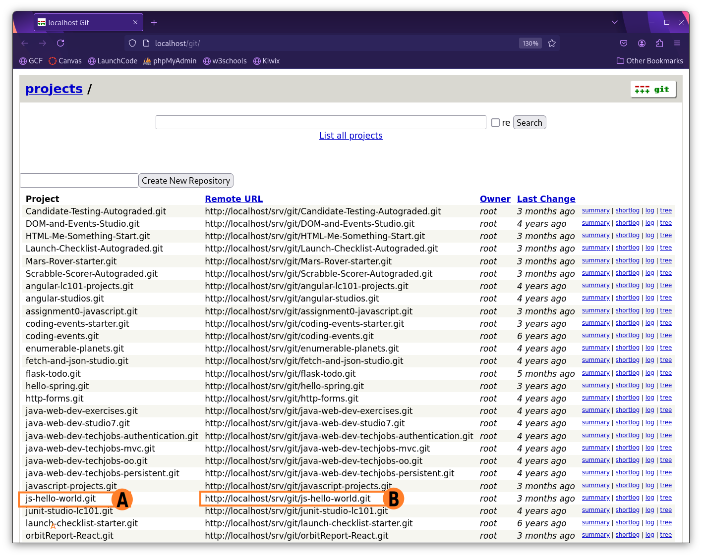
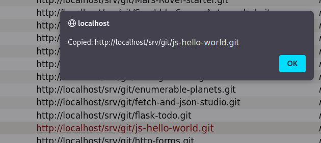

## Your First Program

We are going to walk you through a very simple **workflow**, or sequence of steps, to start coding.

## Read the Instructions

Every starter code repository (repo) in this course will contain instructions.  We strongly suggest you read ALL of the instructions before writing any code.  This will help you understand the goal of your code and may explain any hurdles you might encounter while building your program.

We suggest reading the rest of this page before diving into the code. You will be creating a directory on your computer to store your work, pulling from our GitWeb repository, and practicing with the terminal.  You will do great!

### Starter Code
When you have finished reading through the instructions, use the `js-hello-world` repo to complete your first program.


## Open your terminal

You will use the terminal to create a location to store the code repos.

1. Run the following command: `ls`
This will _list_ any files or directories (folders) wherever you are in the terminal.

   It may look like this:
   ```bash
   ls
   ```

   **Console Output**

   ```console
   Applications   
   Desktop
   Downloads
   Documents
   ...
   ```
1. Choose a folder where you would like to store your course work. This example stores work on the Desktop; you may choose a different location if you desire.

   1. Use the following command to _change directory_, or move, into that folder: `cd <location-name>`
      ```bash
      cd Desktop
      ```
   1. _Make a directory_ (folder) to save your course work: `mkdir <directory-name>`
      ```bash
      mkdir LaunchCode
      ```
   1. To verify if your directory exists run the `ls` command again.  You should see your new directory listed.
   1. Move into your new directory with the following command: `cd <directory-name>`
      ```bash
      cd LaunchCode
      ```

You are now ready to add the repo to your directory.  

## Go to GitWeb

All the git repositories needed for this course are located in GitWeb. You will be provided the name of the repo needed for any particular exercise, studio, or assignment.  You will need to **clone** them to your computer.  When you clone a repo, you are making a copy of the original code.  Any changes you make to the cloned repo will not be applied to the original code.  This keeps the original starter code intact.

1. Open GitWeb by clicking the application icon.
   
      
   
1. Using the GitWeb application locate the desired project and copy its URL to the clipboard.
   
      
   
      A. Find the desired project name in the Project column.
      
      B. Click the corresponding URL in the Remote URL column.
1. You will see the following confirmation that the URL (file path) has been copied to the clipboard.
   
      
   


## Back to the Terminal

Return to your terminal.  You should be in the directory for your course work.

Run the following command: `git clone <paste-the-URL-here>`

   ```bash
   git clone http://localhost/git/REPO-NAME.git
   ```

You will be prompted for your username and password to perform Git operations. Your TA will provide the username and password which will be used throughout this course

If you will be performing multiple git commands in quick succession, you can save your username and password in memory for a short time. Run the command:

   ```bash
   git config credential.helper 'cache --timeout=3600'
   ```

   Your Git credentials will be remembered for a certain amount of time. In the example above, timeout=3600 saves your information for 1 hour (3600 seconds). You can adjust the amount of time up or down as needed.

## Open Visual Studio Code

We haven’t learned how to code yet, but we can still write and run our first program. This exercise asks you to create and run small amounts of code, and it reinforces the LaunchCode principle of learning by doing.

We have used the phrase `Hello, World` as an example throughout this chapter because it represents the traditional first program for a new coder. Printing a single message is one of the simplest tasks a program can carry out.

`Hello, World` will be your first program as well. Welcome to the club!

1. Open your IDE, and open your new repo.  You should see a file tree with the same files from the repo.
   
      
   

1. Double click on `hello.js` to open the file.  You should see instructions and `console.log("Hello");`.  You can type in this file now.  Follow the instructions to complete your first program.  
   1. Enter your code on line 7 to print 'Hello, World!
   1. Open a terminal inside Visual Studio Code.  If you need a refresher, checkout the [installation guide]({}).
   1. Inside your terminal type the following commands
      1. `node hello.js`.  This should run the program, which in this case prints your message in the terminal.  
      ```bash
      node hello.js
      Hello World!
      ```
      A. Another way to run your program is to use the _Run and Debug_ button found on the left icon menu of Visual Studio Code.  Set it to `Node.js` for this project.
      
         
      
   1. Try out the other prompts starting at line 10.
   1. When you are done with this code, you will need to `commit` it.  This is how you use git to track each change in your code.
      1. `git status` This will show you all the files you changed in red.
      1. `git add .` This will 'stage', or prepare all the changed files in this directory to be updated in your repo.
      1. `git status` This will show you all your staged files in green, which are now ready to update.
      1. `git commit -m "<type a message here>"` This will 'commit', or finalize your changes in git. Between the quotes, replace the text and angle brackets `< >` with a short message describing your changes.  This will help you remember what you did while looking through many commits later.

   {} 
   
   Colors may not match exactly as in your terminal.

   ```bash{linenos=table,hl_lines=[],linenostart=1}
   git status
   On branch main
   Your branch is ahead of 'origin/main' by 1 commit.
   (use "git push" to publish your local commits)

   Changes not staged for commit:
   (use "git add <file>..." to update what will be committed)
   (use "git restore <file>..." to discard changes in working directory)
      modified:   hello.js

   Untracked files:
      (use "git add <file>..." to include in what will be committed)
         package-lock.json

   no changes added to commit (use "git add" and/or "git commit -a")

   git add .
   git status
   On branch main
   Your branch is ahead of 'origin/main' by 1 commit.
      (use "git push" to publish your local commits)

   Changes to be committed:
      (use "git restore --staged <file>..." to unstage)
         modified:   hello.js
         new file:   package-lock.json

   git commit -m "now says Hello World"
   [main b1bb194] now says Hello World
   2 files changed, 3457 insertions(+), 1 deletion(-)
    create mode 100644 package-lock.json
   computer:js-hello-world username$$ git push 
   Enumerating objects: 9, done.
   Counting objects: 100% (9/9), done.
   Delta compression using up to 10 threads
   Compressing objects: 100% (7/7), done.
   Writing objects: 100% (7/7), 31.59 KiB | 15.80 MiB/s, done.
   Total 7 (delta 3), reused 0 (delta 0), pack-reused 0
   remote: Resolving deltas: 100% (3/3), completed with 1 local object.
   To http://localhost/git/js-hello-world.git
      408d555..b1bb194  main -> main
   ```

   1. Line 1 `git status` used to check on the latest version of the project. 
   1. Line 6 notes Changes not staged for commit.  We need to add these.
   1. Line 17 `git add .` will add these to GitHub when we are ready to push up.
   1. Line 28 `git commit -m "now says Hello World"` A commit is like taking a photo of the latest version of your code.  The message (`-m`) acts like a caption to keep track of the changes. 

   We will learn more about these in a later chapter.
   {}

   {}
   When writing your commit messages, use present tense.

   When writing your commit messages, you will encounter problems if you include punctuation inside of double quotes `"This wont work!"`.

   If you have a strong desire to include punctuation, you must wrap your commit message inside of single quotes `'Like this!'`.
   {}
   
   
## Check Your Understanding
{} 
Which of the following correctly prints Coding Rocks? There may be more than one valid option.

1. `console.log(Coding Rocks)`
1. `console.log(Coding Rocks);`
1. `console.log('Coding Rocks')`
1. `console.log("Coding Rocks');`
1. `console.log("Coding Rocks");`
<!-- ans: 3 and 5 -->
{}